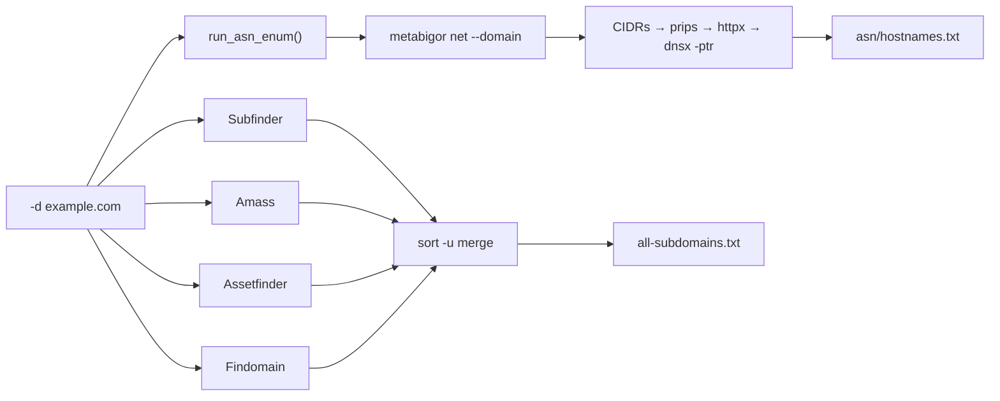
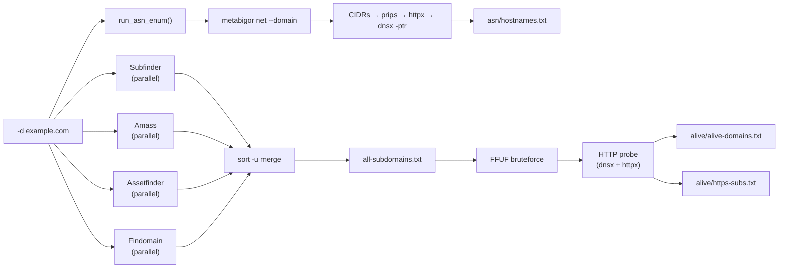
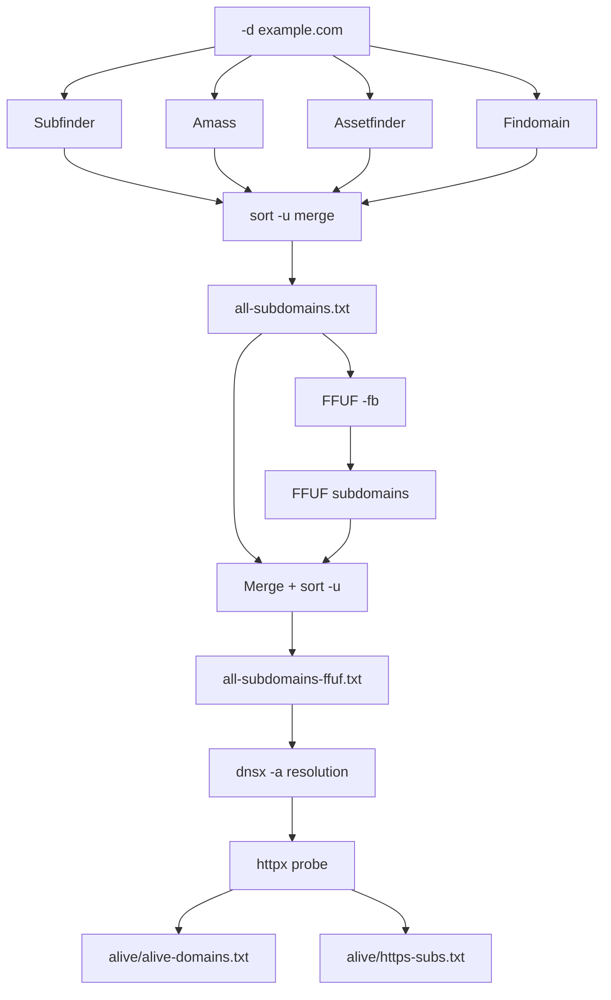
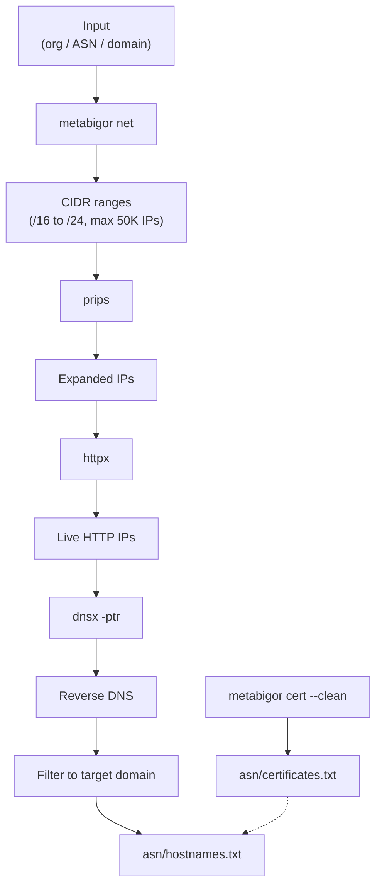

<h1 align="center">
  <br>
  <a href="https://github.com/manojxshrestha/">
    
  </a>
  <br>
  subenum
  <br>
</h1>


<p align="center">
An Automated Subdomain Enumeration Tool with FFUF bruteforce, HTTP probing, and ASN enumeration.
</p>

<div align="center">

[](https://github.com/manojxshrestha/subenum/blob/main/LICENSE)
[](https://github.com/manojxshrestha/subenum)
[](https://github.com/manojxshrestha/subenum/issues)
[](https://github.com/manojxshrestha/subenum)

</div>

---

**subenum** is a powerful bash-based automation tool for subdomain enumeration. It combines multiple tools and includes FFUF bruteforce, HTTP probing, and ASN/organization-based enumeration. **No API keys required!**

---

## Features

* Passive subdomain enumeration using 4 tools (subfinder, amass, assetfinder, findomain)
* Select or exclude specific tools with `-u` / `-e`
* FFUF bruteforce for additional subdomain discovery
* HTTP/HTTPS probing with status codes, titles, and tech detection
* ASN/Organization-based enumeration with reverse DNS PTR sweep
* Certificate transparency search
* Timestamped per-scan output directories (never overwrite results)
* Sensitive domain protection (`--exclude-sensitive`)
* Safe CIDR expansion (`/16` to `/24`, max 50000 IPs)

---

## Supported Tools

### Subdomain Enumeration
* [subfinder](https://github.com/projectdiscovery/subfinder)
* [amass](https://github.com/owasp-amass/amass)
* [assetfinder](https://github.com/tomnomnom/assetfinder)
* [findomain](https://github.com/Findomain/Findomain)

### FFUF & HTTP Probing
* [ffuf](https://github.com/ffuf/ffuf)
* [dnsx](https://github.com/projectdiscovery/dnsx)
* [httpx](https://github.com/projectdiscovery/httpx)

### ASN/Network Enumeration
* [metabigor](https://github.com/j3ssie/metabigor)
* [prips](https://github.com/imusabkhan/prips)

### Utilities
* [anew](https://github.com/tomnomnom/anew) (for deduplication)

---

## Installation

The installer handles everything: system packages, Go tools, and Findomain.

### System packages installed:
```
git          # required by go install for fetching modules
unzip        # extracts Findomain binary
jq           # parses FFUF JSON output at runtime
ca-certificates  # SSL cert bundle for HTTPS downloads
```

### Go tools installed:
`subfinder`, `amass`, `assetfinder`, `dnsx`, `httpx`, `ffuf`, `anew`, `metabigor`, `prips`

### 1. Clone and install

```bash
git clone https://github.com/manojxshrestha/subenum.git
cd subenum
chmod +x install.sh
./install.sh
```

### Installation options

```bash
./install.sh              # Install all tools (skips already installed)
./install.sh --check     # Check installation status
./install.sh --help      # Show help message
./install.sh --force     # Force reinstall all tools
```

### 2. Setup wordlist (for FFUF bruteforce)

```bash
mkdir -p ~/wordlists
# Place your wordlist at: ~/wordlists/subdomains-top1million-110000.txt
# Default is 110K entries; also comes with a 20K version
```

### 3. Refresh shell

```bash
source ~/.bashrc
```

---

## Verify Installation

```bash
chmod +x check.sh
./check.sh
```

---

## Usage

```bash
chmod +x subenum.sh
./subenum.sh -d example.com
```

### Options

| Option | Description |
|--------|-------------|
| `-d, --domain` | Target domain |
| `-l, --list` | File with list of root domains |
| `-u, --use` | Comma-separated tools to use (e.g. subfinder,amass) |
| `-e, --exclude` | Comma-separated tools to exclude (e.g. findomain) |
| `-o, --output` | Output filename |
| `-s, --silent` | Silent mode (outputs only subdomains) |
| `-fb, --ffuf` | Run FFUF subdomain bruteforce after enumeration |
| `-fw, --ffuf-wordlist` | Custom wordlist for FFUF (default: ~/wordlists/subdomains-top1million-110000.txt) |
| `-ft, --ffuf-threads` | FFUF threads (default: 200) |
| `-hp, --http-probe` | Probe for working http/https servers |
| `-ao, --asn-org` | Find IP ranges by organization name |
| `-aa, --asn-asn` | Find IP ranges by ASN (e.g., AS13335) |
| `-ad, --asn-domain` | Find IP ranges by domain |
| `-ac, --asn-cert` | Search subdomains via certificate transparency |
| `-an, --asn-enum` | Auto ASN enumeration using target domain |
| `-es, --exclude-sensitive` | Block sensitive domains (gov, mil, edu, bank, healthcare) |
| `-p, --parallel` | Run tools in parallel (faster) |
| `-h, --help` | Show help |
| `-v, --version` | Show version |
| `-ls, --list-sources` | List all integrated tools |

---

## Examples

### Basic subdomain enumeration
```bash
./subenum.sh -d example.com
```

### With specific tools only
```bash
./subenum.sh -d example.com -u subfinder,assetfinder
```

### Exclude a tool
```bash
./subenum.sh -d example.com -e amass
```

### With FFUF bruteforce
```bash
./subenum.sh -d example.com -fb
```

### With HTTP probing
```bash
./subenum.sh -d example.com -hp
```

### With FFUF + HTTP probing
```bash
./subenum.sh -d example.com -fb -hp
```

### Parallel mode
```bash
./subenum.sh -d example.com -p
```

### With ASN enumeration
```bash
./subenum.sh -d example.com -an
```

### Full mode (parallel + ASN)
```bash
./subenum.sh -d example.com -p -an
```

### ASN by organization
```bash
./subenum.sh -ao "Google"
```

### ASN by number
```bash
./subenum.sh -aa AS13335
```

### Certificate transparency search
```bash
./subenum.sh -ac example.com
```

### Exclude sensitive targets
```bash
./subenum.sh -d example.com -es
```

### Domain list
```bash
./subenum.sh -l domains.txt
```

### Custom wordlist
```bash
./subenum.sh -d example.com -fb -fw /path/to/wordlist.txt
```

---

## Workflow Diagrams

### `./subenum.sh -d example.com -an`
ASN enumeration runs first (discovers IP ranges via domain), then the 4 passive tools enumerate subdomains, then results merge into one file.



### `./subenum.sh -d example.com -p -an`
Same as above but tools run in parallel (faster) and auto-enables FFUF + HTTP probe.



### `./subenum.sh -d example.com -fb -hp`
Standard enumeration, then FFUF bruteforce on discovered subdomains, then HTTP probing with dnsx + httpx.



---

## Output Structure

Every run creates a timestamped directory. No data is ever overwritten.

```
outputs/example.com-2026-05-13_14-30-00/
    ├── all-subdomains.txt          # Merged subdomains (kept if -hp NOT used)
    ├── all-subdomains-ffuf.txt     # Merged + FFUF results (kept if -fb AND -hp NOT used)
    ├── temp/                       # Auto-cleaned on normal exit
    │   ├── tmp-subfinder-{domain}.txt
    │   ├── tmp-amass-{domain}.txt
    │   ├── tmp-assetfinder-{domain}.txt
    │   ├── tmp-findomain-{domain}.txt
    │   ├── subdomains.txt
    │   ├── ffufsubdomains.txt
    │   ├── finalsubdomains.txt
    │   ├── alivesubdomains.txt
    │   ├── filtersubdomains.txt
    │   ├── asn-cidrs.txt
    │   └── asn-ips.txt
    ├── alive/                       # (only when -hp used)
    │   ├── alive-domains.txt       # Clean domain names
    │   └── https-subs.txt          # HTTPS URLs only
    └── asn/                         # (only when -ao/-aa/-ad/-ac/-an used)
        ├── hostnames.txt           # Reverse DNS results + cert subdomains
        ├── cidrs.txt               # Discovered CIDR ranges
        └── certificates.txt        # Certificate transparency subdomains
```

**Output logic:**
- Without `-hp`: `all-subdomains.txt` is your deliverable (raw merged list)
- With `-hp`: `alive/` is your deliverable (probed, verified live hosts — raw list is redundant)
- `temp/` is always deleted on normal exit. On Ctrl+C, the entire run dir is deleted
- `asn/` results are always kept regardless of other flags

---

## ASN Enumeration Pipeline



Additionally, certificate transparency results are appended to `asn/hostnames.txt`.

---

## Sensitive Domain Protection

subenum ships with a sensitive domain blocklist at `config/sensitive-domains.txt`:

```
*.gov          *.mil          *.edu          *.bank
*.gov.*        *.military.*   *.ac.*         *.banking.*
*.gob.*        *.army.*       *.university.* *.healthcare.*
*.gouv.*       *.navy.*       *.college.*    *.hospital.*
*.government.* *.defense.*    *.school.*     *.emergency.*
```

Enable with `-es` / `--exclude-sensitive`. This only checks the **target domain**, not ASN results — matching the reconftw workflow. Customize the file to add your own patterns.

---

## ASN Safety

- Only expands CIDRs `/16` to `/24` (catches real ISP/bank ranges, skips `/8`/`/15` etc.)
- Maximum 50000 IPs per scan (prevents httpx from running indefinitely)
- Filters reverse DNS results to match target domain
- No hardcoded IP blocklist — CIDR size filter + IP cap handle all safety cases

---

## License

This project is open-source and available under the [MIT License](LICENSE).
